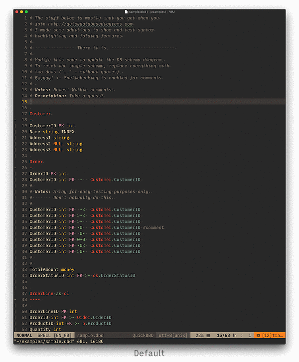

# `Quick Database Diagrams` mode for Vim

> Vim syntax highlighting and folding mode for plaintext database diagrams used by the [Quick Database Diagrams](http://quickdatabasediagrams.com) web app.

The syntax colouring is straight forward and is quite customisable. The file suffixes supported are `.dbd` `.qdd` and `.qdb`. No preference, pick whatever tickles your fancy. You can change it at any point by editing the file in `/ftdetect`.

## This is what it looks like.

***
Got some value out of this? Want to support further versions?

***

## How to Install
Take the contents on the `vim` folder and put them in the matching places in your local `.vim` folder. No fancy installer or complicated setup. Just drag and drop. Some folder doesn't exist? Now it does, just drag it over.

## How to customise
When you look into the `after/syntax` folder you'll find a file with all the settings pre-populated, reading for messing with. Un-comment the ones you want to use, add your settings, save and that's it. Examples are at the top of the file.

## Why?
1. I don't like big glaring white areas blasting my face when I'm thinking about how to structure something.
2. It's a web app. Always better to have something more tangible.
3. Vim means I can have all sorts of split views on folds when structuring a database. Or anything, really. If you've followed my Emacs stuff, I like big comprehensive views into my data. Helps overcome writer's block.

## The future?
If you find bugs, I'm tending to them. Same goes for when I come across any.

### Emacs? Probably not.
I don't think I'll do an Emacs mode. I'm just not familiar enough with doing a full mode setup in Emacs yet. Also it's pretty comfortable to just <kbd>CMD</kbd>+<kbd>TAB</kbd> between the two when I'm writing and need to do a quick edit without leaving my layout.